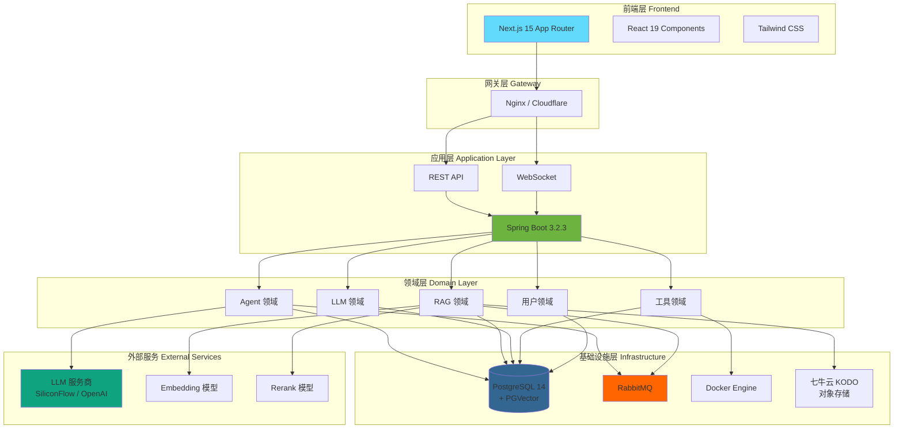
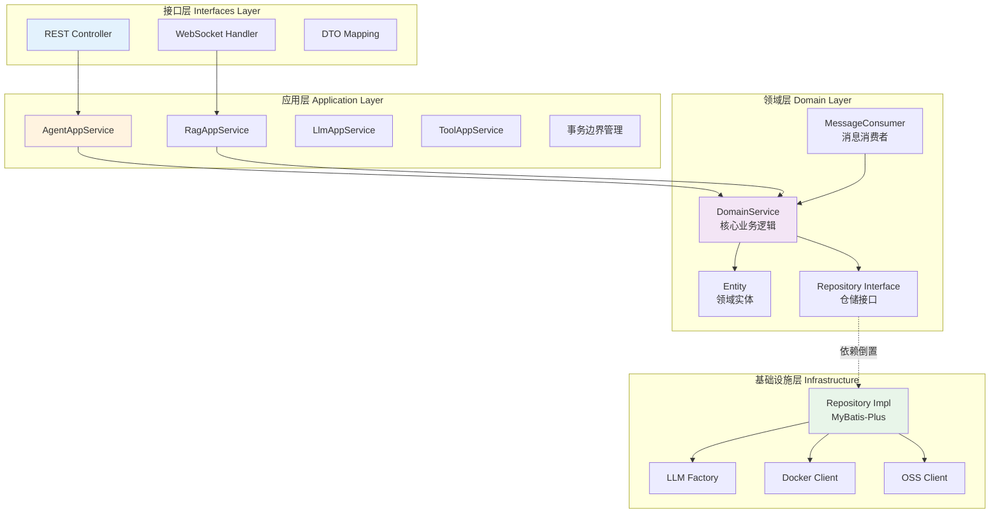
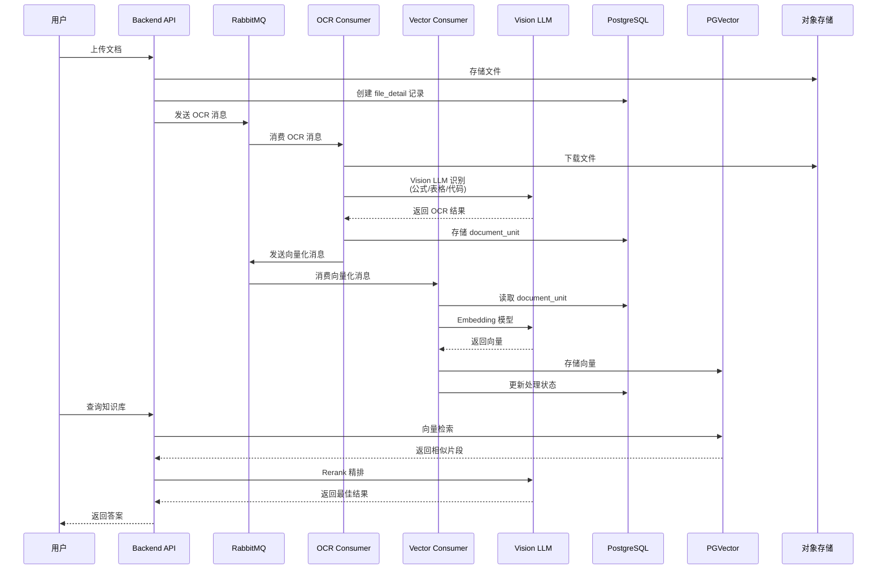
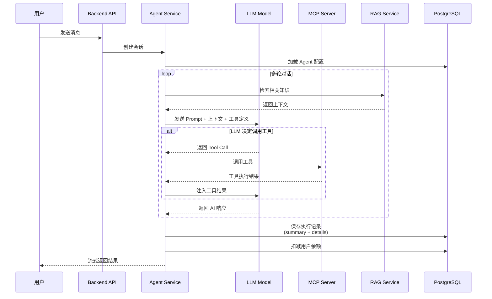
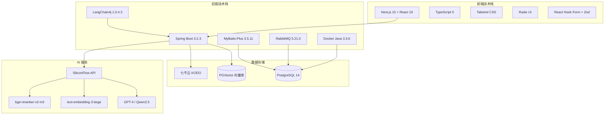

# RAG Agent Platform - 基于 LLM/RAG/MCP 的多租户智能体 SaaS 平台


[](https://openjdk.java.net/)
[](https://spring.io/projects/spring-boot)
[](https://nextjs.org/)
[](https://www.postgresql.org/)
[](LICENSE)

> 产品主页


> RAG 知识库


> 模型服务商配置


> 使用他人发布的 Agent 助手


---

## 项目简介

**RAG Agent Platform** 是一个企业级多租户智能体 SaaS 平台，整合了大语言模型（LLM）、检索增强生成（RAG）和模型上下文协议（MCP）技术。本项目的产品视角设计思路参照 [Dify](https://github.com/langgenius/dify) 平台，采用 DDD 分层架构和事件驱动模式，提供更灵活的技术选型和扩展能力。

平台为用户提供：

- **智能知识库** - 上传文档（PDF/WORD/TXT），自动 OCR 识别 + 向量化，构建企业级知识库
- **Agent 编排** - 基于 LangChain4j 快速创建智能体，支持工具调用、多轮对话、任务分解
- **一键集成** - 灵活接入 OpenAI、SiliconFlow 等多种 LLM 服务商，支持主备模型切换
- **工具生态** - 容器化 MCP 工具管理，支持 Docker/GitHub/NPM 多种部署方式
- **精确计费** - Token 级别成本统计，完整执行链路追踪
- **多租户隔离** - 数据库级别隔离，JWT 认证，保障数据安全


## 核心特性

### RAG 增强能力

- **Vision LLM OCR** - 智能识别数学公式、表格、代码块
- **混合检索** - 向量召回 + Rerank 精排 + 查询扩展
- **版本化机制** - 支持引用型（实时同步）和快照型（数据隔离）两种版本模式
- **进度追踪** - 实时展示 OCR 和向量化处理进度（0-100%）
- **降级召回** - 相似度阈值过高时自动降低重试，保证召回率

### Agent 智能编排

- **LangChain4j 集成** - 标准化 Agent 编排框架，支持流式输出
- **MCP 工具集成** - 容器化工具管理，支持 Function Calling
- **多模态支持** - 文本 + 图像输入，支持 Vision 模型
- **版本管理** - Agent 草稿编辑 → 审核 → 发布 → 回滚完整流程
- **执行追踪** - 双表追踪模型（汇总 + 详情），记录每次执行的完整链路

### 安全与多租户

- **JWT 认证** - 无状态认证（7 天有效期）
- **数据隔离** - 数据库层面多租户隔离（MyBatis-Plus 插件）
- **API Key 加密** - AES 加密存储用户密钥
- **限流** - Guava RateLimiter 保护 API
- **逻辑删除** - 软删除保留历史数据


## 系统架构

### 整体架构



### DDD 分层架构



### RAG 处理流程



### Agent 执行流程



### 技术栈架构



## 技术栈

### 后端

| 技术 | 版本 | 说明 |
|------|------|------|
| Java | 17 | 编程语言 |
| Spring Boot | 3.2.3 | 应用框架 |
| LangChain4j | 1.0.4.3-beta7 | Agent 编排框架 |
| MyBatis-Plus | 3.5.11 | ORM 框架 |
| PostgreSQL | 14+ | 关系数据库 |
| PGVector | 0.5.0 | 向量数据库扩展 |
| RabbitMQ | 5.21.0 | 消息队列 |
| Docker Java | 3.3.6 | 容器管理 |
| JWT | 0.12.5 | 认证 |
| Apache PDFBox | 3.0.2 | PDF 处理 |
| Apache POI | 5.4.0 | Office 文档处理 |

### 前端

| 技术 | 版本 | 说明 |
|------|------|------|
| Next.js | 15.1.0 | React 框架 |
| React | 19 | UI 库 |
| TypeScript | 5 | 类型安全 |
| Tailwind CSS | 3.4.17 | 原子化 CSS |
| Radix UI | - | 无头 UI 组件 |
| React Hook Form | 7.54.1 | 表单管理 |
| Zod | 3.24.1 | Schema 验证 |
| Axios | 1.8.4 | HTTP 客户端 |
| Xterm.js | - | 终端模拟器 |

### 基础设施

- **对象存储**: 七牛云 KODO / Amazon S3
- **LLM 服务商**: SiliconFlow（硅基流动）
- **部署**: Docker Compose
- **监控**: Spring Boot Actuator

---

## 功能模块

### 1. Agent 智能体模块

- Agent 创建、编辑、删除
- System Prompt 配置（定义角色与行为）
- 工具集成（MCP 工具调用）
- 知识库关联（RAG 增强）
- 多模态支持（文本 + 图像）
- 版本发布、审核、回滚
- 会话管理（多轮对话）
- 执行追踪（完整链路记录）
- 成本统计（Token 级别计费）

### 2. RAG 知识库模块

- 文档上传（PDF/WORD/TXT/MD）
- Vision LLM OCR（识别公式/表格/代码）
- 向量化处理（Embedding 模型）
- 混合检索（向量召回 + Rerank 精排）
- 查询扩展（获取相邻页面上下文）
- 版本化机制（引用型 vs 快照型）
- 进度追踪（实时展示处理进度）
- 降级召回（阈值自动调整）

### 3. LLM 模型管理

- 模型提供商管理（OpenAI、SiliconFlow 等）
- 模型配置（API Key、Base URL、模型 ID）
- Embedding 模型管理
- 模型高可用（主模型 + 平替模型）
- Token 计费（精确到小数点后 8 位）

### 4. MCP 工具模块

- 工具定义（Function Schema）
- 工具上传（Docker/GitHub/NPM）
- 容器化部署（Docker Engine）
- 工具调用（Function Calling）
- 工具预设参数（加密存储）

### 5. 用户与认证

- 用户注册/登录（JWT 认证）
- 邮箱验证码（SMTP）
- 图形验证码（防机器人）
- 密码重置
- 用户设置（模型配置、Fallback 策略）

## 快速开始

### 前置要求

- Java 17+
- Node.js 18+
- PostgreSQL 14+（需安装 PGVector 扩展）
- RabbitMQ 3.13+
- Docker & Docker Compose
- 对象存储服务（七牛云 KODO / Amazon S3）
- LLM API Key（SiliconFlow / OpenAI）

### 本地开发

#### 1. 安装 PostgreSQL + PGVector

```bash
# macOS
brew install postgresql@14
brew services start postgresql@14

# 创建数据库和扩展
psql -d postgres -c "CREATE DATABASE agentx;"
psql -d agentx -c "CREATE EXTENSION IF NOT EXISTS vector;"
```

#### 2. 安装 RabbitMQ

```bash
# macOS
brew install rabbitmq
brew services start rabbitmq

# 访问管理界面: http://localhost:15672
# 默认账号: guest / guest
```

#### 3. 配置环境变量

复制 `.env.example` 为 `.env` 并填写配置：

```bash
# 数据库配置
DB_HOST=localhost
DB_PORT=5432
DB_USER=postgres
DB_PASSWORD=postgres
DB_NAME=agentx

# RabbitMQ
RABBITMQ_HOST=localhost
RABBITMQ_PASSWORD=guest

# 对象存储（七牛云）
S3_SECRET_ID=your-access-key
S3_SECRET_KEY=your-secret-key
S3_BUCKET_NAME=your-bucket
S3_DOMAIN=https://your-domain/

# AI 模型（硅基流动）
SILICONFLOW_API_KEY=sk-xxx

# 前端配置
NEXT_PUBLIC_API_URL=http://localhost:8088/api
NEXT_PUBLIC_WS_URL=ws://localhost:8088/api
```

#### 4. 初始化数据库

```bash
psql -h localhost -U postgres -d agentx -f ./docs/sql/01_init.sql
```

#### 5. 启动后端

```bash
# Maven 构建
mvn clean install -DskipTests

# 启动 Spring Boot
mvn spring-boot:run
```

访问: http://localhost:8088/api/health

#### 6. 启动前端

```bash
cd frontend
npm install
npm run dev
```

访问: http://localhost:3000

#### 7. 默认账号

- 管理员: `admin@agentx.ai / admin123`
- 测试账号: `test@agentx.ai / test123`


## Docker Compose 部署

### 上传至阿里云容器镜像服务 ACR


### 服务器端部署 Docker 容器
```bash
# 1. 克隆项目
git clone https://github.com/NEDONION/rag-agent-platform
cd rag-agent-platform

# 2. 配置环境变量
cp .env.example .env
vim .env

# 3. 启动服务
docker compose up -d

# 4. 查看日志
docker logs -f agentx-backend
docker logs -f agentx-frontend

# 5. 访问应用
# 前端: http://your-server-ip:3000
# 后端: http://your-server-ip:8088/api
```

### 服务说明

| 服务 | 端口 | 说明 |
|------|------|------|
| frontend | 3000 | Next.js 前端 |
| backend | 8088 | Spring Boot 后端 |
| rabbitmq | 5672, 15672 | RabbitMQ 消息队列 |

### 资源限制

- **Backend**: 768M-1536M 内存, 0.8-1.2 核 CPU
- **Frontend**: 384M-768M 内存, 0.3-0.6 核 CPU
- **RabbitMQ**: 256M-512M 内存, 0.1-0.3 核 CPU

详细部署指南请查看: [DEPLOY.md](./DEPLOY.md)

---

## 项目结构

```
rag-agent-platform/
├── frontend/                # Next.js 15 前端应用
│   ├── app/                # App Router 页面
│   │   ├── (auth)/         # 认证相关页面
│   │   ├── (main)/         # 主应用页面
│   │   │   ├── studio/     # Agent 工作室
│   │   │   ├── workspace/  # 工作区
│   │   │   ├── knowledge/  # 知识库管理
│   │   │   ├── settings/   # 设置中心
│   │   │   ├── explore/    # 探索市场
│   │   │   └── admin/      # 管理后台
│   │   └── providers.tsx   # 全局 Provider
│   ├── components/         # 可复用组件
│   ├── hooks/              # 自定义 Hooks
│   └── types/              # TypeScript 类型
│
├── src/main/               # Spring Boot 后端应用
│   ├── java/org/lucas/
│   │   ├── application/    # 应用层（AppService）
│   │   ├── domain/         # 领域层（DomainService + Entity）
│   │   ├── infrastructure/ # 基础设施层（Repository + Utils）
│   │   └── interfaces/     # 接口层（Controller + DTO）
│   └── resources/
│       └── application.yml # 配置文件
│
├── docs/                   # 技术文档
│   ├── ARCHITECTURE.md     # 系统架构文档
│   ├── DATABASE.md         # 数据库设计文档
│   ├── API.md              # API 接口文档
│   ├── RAG_MODULE.md       # RAG 模块文档
│   └── AGENT_MODULE.md     # Agent 模块文档
│
├── docker-compose.yml      # Docker Compose 配置
├── Dockerfile              # 后端 Dockerfile
├── .env.example            # 环境变量示例
├── DEPLOY.md               # 部署指南
└── README.md               # 项目说明
```

---

## API 文档

详细 API 文档请查看: [docs/API.md](./docs/API.md)

### 核心 API 端点

#### 认证 API

- `POST /login` - 用户登录
- `POST /register` - 用户注册
- `POST /get-captcha` - 获取图形验证码
- `POST /send-email-code` - 发送邮箱验证码

#### Agent API

- `GET /api/agents` - 获取 Agent 列表
- `POST /api/agents` - 创建 Agent
- `PUT /api/agents/{id}` - 更新 Agent
- `POST /api/agents/{id}/publish` - 发布版本
- `GET /api/agents/{id}/versions` - 版本历史

#### 会话 API

- `GET /api/sessions` - 获取会话列表
- `POST /api/sessions` - 创建会话
- `POST /api/sessions/{id}/messages` - 发送消息（SSE 流式）
- `GET /api/sessions/{id}/messages` - 获取消息历史

#### RAG API

- `GET /api/rags` - 获取知识库列表
- `POST /api/rags` - 创建知识库
- `POST /api/rags/{id}/files/upload` - 上传文件
- `GET /api/rags/{id}/files/{fileId}/status` - 文件处理状态
- `POST /rag/search` - RAG 检索

---

## 技术亮点

### 1. DDD 分层架构
- 业务逻辑集中在领域层
- 清晰的领域模型
- 依赖倒置原则

### 2. RAG 技术
- Vision LLM OCR 识别公式/表格
- 混合检索（向量召回 + Rerank 精排）
- 查询扩展保证上下文完整性
- 降级召回提升召回率

### 3. Agent 编排
## 技术亮点（详细版）

### 1. DDD 分层架构与领域驱动设计

采用严格的 DDD 四层架构，实现高内聚低耦合：

**接口层 (Interfaces Layer)**
- REST Controller 负责 HTTP 请求处理和参数验证
- WebSocket Handler 处理实时流式输出
- DTO 与 Entity 的双向转换（使用 MapStruct 自动生成）

**应用层 (Application Layer)**
- AppService 作为事务边界，协调多个领域服务
- 编排复杂业务流程（如 Agent 发布需调用版本服务、审核服务、通知服务）
- 异常统一处理和日志记录

**领域层 (Domain Layer)**
- DomainService 封装核心业务逻辑（如 RAG 检索策略、Agent 决策逻辑）
- Entity 富含业务行为（如 `Agent.publish()` 方法包含发布前的校验逻辑）
- Repository Interface 定义数据访问契约，遵循依赖倒置原则
- Event-Driven：通过 Spring ApplicationEvent 实现领域事件发布

**基础设施层 (Infrastructure)**
- Repository Implementation 使用 MyBatis-Plus 实现
- LLM Factory 封装多种模型提供商的适配逻辑
- Docker Client 封装容器管理 API

**优势**：
- 业务逻辑与技术实现解耦，易于测试和替换
- 清晰的依赖方向（上层依赖下层，领域层不依赖基础设施层）
- 便于横向扩展（可将不同领域拆分为微服务）

---

### 2. RAG 混合检索与智能召回

实现了业界领先的 RAG 检索流水线，结合多种技术保证召回质量：

**Vision LLM OCR 文档处理**
- 使用 Qwen-VL-Max 等视觉大模型进行文档 OCR
- 支持识别复杂场景：LaTeX 公式、表格、代码块、手写笔记
- 逐页处理机制：每页独立 OCR 并存储为 `document_unit`，避免内存溢出
- 内存管理：每处理 10 页执行一次 GC，防止堆内存泄漏

**向量化与存储**
- 使用 text-embedding-3-large (1024维) / bge-large-zh-v1.5 生成向量
- PGVector 扩展提供高性能向量存储（IVFFlat 索引）
- 元数据过滤：支持按 `dataset_id`、`version`、`user_id` 等字段过滤

**混合检索策略**
1. **向量召回阶段**：
   - PGVector 余弦相似度检索（Cosine Similarity）
   - 初始召回 Top-50 候选文档片段
   - 相似度阈值 0.3（可动态调整）

2. **Rerank 精排阶段**：
   - 使用 bge-reranker-v2-m3 模型重排序
   - 将 Top-50 精排至 Top-5，显著提升相关性
   - 计算跨注意力分数（Cross-Attention Score）

3. **查询扩展**：
   - 获取命中片段的前后相邻页面（±1 页）
   - 保证上下文连贯性，避免"断章取义"

4. **降级召回机制**：
   - 当相似度阈值 > 0.7 但召回数 < 3 时，自动降低阈值至 0.5 重试
   - 最多重试 3 次，保证用户至少看到部分结果

**版本化机制**
- 引用型版本 (0.0.1)：向量数据实时同步，动态更新
- 快照型版本 (≥1.0.0)：向量数据完全隔离，发布时深拷贝向量

---

### 3. Agent 编排与 MCP 工具集成

基于 LangChain4j 构建灵活的 Agent 系统，支持复杂任务分解与工具调用：

**LangChain4j 集成**
- 使用 `AiServices` 接口自动生成 Agent 代理
- 支持流式输出（SSE）：前端实时展示 Agent "思考过程"
- 内置 Prompt 模板引擎（Mustache）

**MCP (Model Context Protocol) 工具管理**
- 容器化部署：每个 MCP Server 独立运行在 Docker 容器中
- 工具定义：使用 JSON Schema 描述工具参数（Function Schema）
- 动态加载：Agent 启动时从数据库加载工具列表并注入到 LLM

**工具调用流程**
1. LLM 返回 `ToolExecutionRequest`（包含工具名和参数）
2. 解析工具名称，查找对应的 MCP Server 容器
3. 通过 HTTP/WebSocket 调用 MCP Server
4. 获取工具执行结果，注入到下一轮 LLM 推理

**预设参数加密**
- 用户级工具配置（如 API Key、SMTP 账号）使用 AES-256 加密
- 存储在 `agent.tool_preset_params` JSONB 字段
- 运行时解密并注入到工具调用

**执行追踪双表模型**
- `agent_execution_summary`：汇总表（trace_id、总耗时、总 Token、总成本）
- `agent_execution_details`：详情表（每个步骤的完整记录）
- 分区表设计：按月分区（如 `details_202412`），提升查询性能

---

### 4. 高性能异步处理与消息队列

基于 RabbitMQ 构建事件驱动架构，实现高并发文档处理：

**RabbitMQ 配置**
- 19 个并发消费者（`concurrency=19`）
- 手动确认模式（Manual ACK）：保证消息不丢失
- 死信队列（DLX）：处理失败的消息自动转入死信队列
- 重试机制：最多重试 3 次，超过则标记为失败

**消息队列拓扑**
- `ocr.queue`：OCR 处理队列
- `embedding.queue`：向量化处理队列
- `agent.task.queue`：Agent 异步任务队列

**处理流程**
1. 用户上传文件 → 发送 OCR 消息
2. OCR 消费者下载文件 → Vision LLM 识别 → 存储 `document_unit`
3. 自动触发向量化消息 → Embedding 消费者处理 → 存储向量

**性能优化**
- 批量插入向量：每 100 条向量批量插入 PGVector
- 连接池复用：HikariCP 最大 20 连接，避免频繁创建连接
- 模型实例缓存：LLM 和 Embedding 模型实例缓存在 `ConcurrentHashMap`

---

### 5. 数据库设计与查询优化

**PGVector 向量索引**
- IVFFlat 索引：将向量空间划分为 100 个聚类（lists=100）
- 查询时只扫描最近的 10 个聚类（probes=10），大幅提升查询速度

**多租户数据隔离**
- MyBatis-Plus 多租户插件：自动注入 `WHERE user_id = ?`
- 所有核心表包含 `user_id` 字段（复合索引）

**分区表设计**
- `agent_execution_details` 按月分区
- 自动清理 90 天前的分区，节省存储空间

**慢查询优化**
- 覆盖索引：查询列表时只查询必要字段（避免 `SELECT *`）
- 分页优化：使用 `LIMIT + OFFSET` 并配合 `id > last_id` 避免深分页

---

### 6. 安全设计与认证机制

**JWT 无状态认证**
- 使用 JJWT 库生成 JWT Token（有效期 7 天）
- Payload 包含：`userId`、`username`、`roles`
- 签名算法：HS256（HMAC-SHA256）

**API Key 加密存储**
- 用户的 LLM API Key 使用 AES-256-CBC 加密
- 加密密钥存储在环境变量 `ENCRYPTION_KEY`
- 每次调用 LLM 时解密 API Key

**多租户数据隔离**
- 数据库层面：MyBatis-Plus 自动注入 `user_id` 过滤条件
- 应用层面：从 JWT Token 提取 `userId`，所有查询自动过滤

**限流与防刷**
- Guava RateLimiter：单用户每秒最多 10 次 Agent 调用
- Redis 限流：全局每分钟最多 1000 次 OCR 请求
