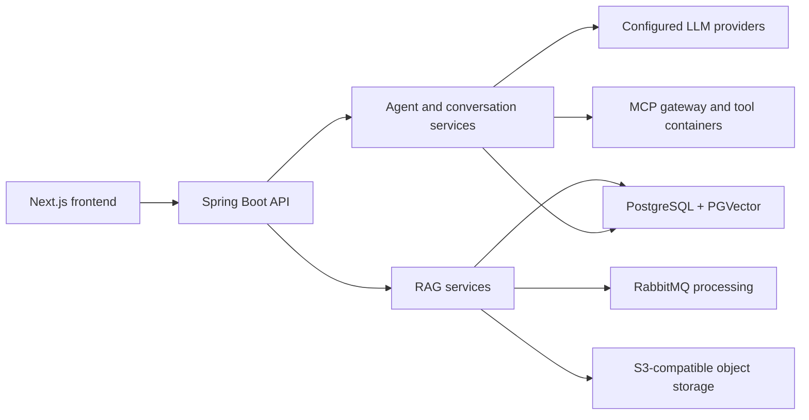

# RAG Agent Platform

[](https://openjdk.org/)
[](https://spring.io/projects/spring-boot)
[](https://nextjs.org/)

> A self-hosted Spring Boot, Next.js, and LangChain4j application for building knowledge bases, configurable Agents, and MCP-powered tools.


## What you can do

- **Build knowledge bases** — ingest documents, process them for retrieval, and use them in RAG workflows.
- **Configure and publish Agents** — connect model providers, manage Agent versions, and stream conversations through SSE.
- **Bring MCP tools into an Agent** — import a tool from a GitHub repository or ZIP archive, then manage its container-based runtime.

## Quick start

### Prerequisites

- Java 17 and Maven 3.9+
- Node.js 20 and pnpm
- PostgreSQL 14+ with the `vector` extension
- RabbitMQ 3.13+
- S3-compatible object storage (for example, Qiniu KODO)
- A configured model/reranker provider and SMTP service
- Docker, when you use container-managed MCP tools

### 1. Prepare services and configuration

Create a PostgreSQL database and enable PGVector:

```bash
createdb agentx
psql -d agentx -c "CREATE EXTENSION IF NOT EXISTS vector;"
psql -d agentx -f docs/sql/01_init.sql
```

Start RabbitMQ, then copy `.env.example` as a reference for the required database, RabbitMQ, object-storage, model, and SMTP values:

```bash
cp .env.example .env
```

Fill in `.env`, then expose those values through your shell or IDE run configuration before starting the backend. The Spring Boot application does not load the repository-root `.env` file by itself.

Create `frontend/.env.local` with the browser-visible addresses:

```dotenv
NEXT_PUBLIC_API_URL=http://localhost:8088/api
NEXT_PUBLIC_WS_URL=ws://localhost:8088/api
```

### 2. Start the application

In one terminal, start the backend from the repository root:

```bash
mvn spring-boot:run
```

In another terminal, start the frontend:

```bash
cd frontend
pnpm install
pnpm dev
```

Open the application at [http://localhost:3000](http://localhost:3000). The backend health endpoint is [http://localhost:8088/api/health](http://localhost:8088/api/health).

## Product tour

### Knowledge bases

Create and browse knowledge bases, then inspect their document-processing details.


### Agents and model providers

Configure model providers, publish an Agent, and use an Agent shared by another user.


## How it fits together


```mermaid
flowchart LR
    Browser["Next.js frontend"] --> API["Spring Boot API"]
    API --> Agent["Agent and conversation services"]
    API --> RAG["RAG services"]
    Agent --> LLM["Configured LLM providers"]
    Agent --> MCP["MCP gateway and tool containers"]
    RAG --> Queue["RabbitMQ processing"]
    RAG --> Data["PostgreSQL + PGVector"]
    RAG --> Storage["S3-compatible object storage"]
    Agent --> Data
```

| Area | Implementation |
| --- | --- |
| Backend | Java 17, Spring Boot 3.2.3, LangChain4j |
| Frontend | Next.js 15, React 19 |
| Data | PostgreSQL 14+ with PGVector |
| Asynchronous work | RabbitMQ |
| File storage | S3-compatible object storage |
| Streaming | Server-Sent Events (SSE) |

## Deployment notes

The included Docker Compose configuration is an author deployment setup, not a one-command public installation: it expects externally configured PostgreSQL and object storage, uses a private frontend image registry, and does not supply the MCP gateway configuration. Treat it as a deployment reference and adapt it to your own infrastructure.


## Documentation

- [Documentation index](docs/INDEX.md)
- [System architecture](docs/ARCHITECTURE.md)
- [RAG module](docs/RAG_MODULE.md)
- [Agent module](docs/AGENT_MODULE.md)
- [API reference](docs/API.md)
- [Database schema and initialization](docs/sql/01_init.sql)

## Current scope

- This repository is a self-hosted project and does not currently provide a public demo environment.
- Conversation streaming currently uses SSE.
- MCP tool import supports GitHub repositories and ZIP archives; the container runtime needs Docker and MCP gateway configuration.
- Review the repository configuration and infrastructure requirements before using it in a production environment.

## Contributing

Issues and pull requests are welcome. Please describe the problem, the environment, and the verification you performed.
