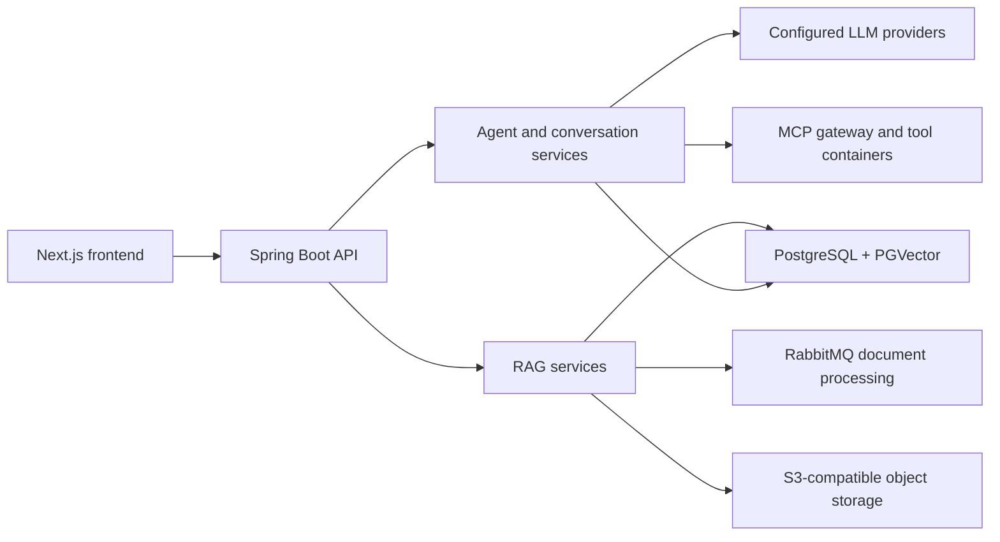

<h1 align="center">RAG Agent Platform</h1>

<p align="center"><strong>Put knowledge bases, Agents, and MCP tools into one self-hosted workflow.</strong></p>

<p align="center">
  Built with Spring Boot, Next.js, and LangChain4j to bring retrieval, conversation, and tool use together while you keep control of your data, models, and infrastructure.
</p>

<p align="center"><strong>English</strong> · <a href="README_ZH.md">简体中文</a></p>

<p align="center">
  <a href="http://39.97.58.27/explore"><strong>Live Demo: 39.97.58.27/explore</strong></a>
</p>

<p align="center">
  <a href="https://openjdk.org/"></a>
  <a href="https://spring.io/projects/spring-boot"></a>
  <a href="https://nextjs.org/"></a>
  
</p>

<p align="center">
  <a href="#features">Features</a> ·
  <a href="#quick-start">Quick Start</a> ·
  <a href="#screenshots">Screenshots</a> ·
  <a href="#how-it-works">How It Works</a> ·
  <a href="#deployment-notes">Deployment</a> ·
  <a href="#project-scope">Scope</a> ·
  <a href="#documentation">Documentation</a>
</p>

From document ingestion and vector retrieval to user-facing Agent conversations, this project brings the core RAG workflow into one console: create knowledge bases, configure models and Agents, then connect them to already configured MCP tools. It is designed for teams that need control over their data and deployment, with an Alibaba Cloud environment available for trying the main workflow.


<p align="center"><sub>Manage knowledge bases, Agents, model providers, and MCP tools from one workspace.</sub></p>

## Features

| Capability | What you can do |
| --- | --- |
| **Knowledge bases and retrieval** | Upload and process documents, use PostgreSQL + PGVector for vector retrieval, and connect knowledge bases to RAG conversations. |
| **Configurable Agents** | Configure model providers, manage and publish Agents, and stream conversation responses over SSE. |
| **MCP tool integration** | Connect Agents to a configured MCP gateway and tool containers; the current UI does not provide a complete tool-import workflow, so configure the gateway and containers manually. |
| **Self-hosted control** | Deploy your own workflow with Spring Boot, Next.js, RabbitMQ, S3-compatible object storage, and external model services. |

## Quick Start

### Prerequisites

- Java 17 and Maven 3.9+
- Node.js 20 and pnpm
- PostgreSQL 14+ with the `vector` extension
- RabbitMQ 3.13+
- S3-compatible object storage, such as Qiniu KODO
- A configured model / reranker provider and SMTP service
- Docker when you use container-managed MCP tools

### 1. Prepare services and configuration

Create a database and enable PGVector:

```bash
createdb agentx
psql -d agentx -c "CREATE EXTENSION IF NOT EXISTS vector;"
psql -d agentx -f docs/sql/01_init.sql
```

Start RabbitMQ. Create `.env` from `.env.example` and fill in the database, RabbitMQ, object-storage, model, and SMTP settings; then provide those values through your shell or IDE run configuration. Spring Boot does not load the repository-root `.env` file by itself:

```bash
cp .env.example .env
```

Create `frontend/.env.local` with the browser-visible service addresses:

```dotenv
NEXT_PUBLIC_API_URL=http://localhost:8088/api
NEXT_PUBLIC_WS_URL=ws://localhost:8088/api
```

### 2. Start the application

Start the backend from the repository root:

```bash
mvn spring-boot:run
```

In another terminal, start the frontend:

```bash
cd frontend
pnpm install
pnpm dev
```

Open [http://localhost:3000](http://localhost:3000). The backend health endpoint is [http://localhost:8088/api/health](http://localhost:8088/api/health).

## Screenshots

<table>
  <tr>
    <td width="50%" valign="top">
      <strong>Knowledge-base list</strong><br />
      <sub>Browse and organize the knowledge bases available for retrieval from one entry point.</sub><br /><br />
      
    </td>
    <td width="50%" valign="top">
      <strong>Knowledge-base detail</strong><br />
      <sub>Inspect document processing status and knowledge-base contents.</sub><br /><br />
      
    </td>
  </tr>
  <tr>
    <td width="50%" valign="top">
      <strong>Model-provider configuration</strong><br />
      <sub>Configure the model services available to an Agent.</sub><br /><br />
      
    </td>
    <td width="50%" valign="top">
      <strong>Published Agent</strong><br />
      <sub>Start a conversation with an Agent published by another user.</sub><br /><br />
      
    </td>
  </tr>
</table>

## How It Works


```mermaid
flowchart LR
    Browser["Next.js frontend"] --> API["Spring Boot API"]
    API --> Agent["Agent and conversation services"]
    API --> RAG["RAG services"]
    Agent --> LLM["Configured LLM providers"]
    Agent --> MCP["MCP gateway and tool containers"]
    RAG --> Queue["RabbitMQ document processing"]
    RAG --> Data["PostgreSQL + PGVector"]
    RAG --> Storage["S3-compatible object storage"]
    Agent --> Data
```

The browser reaches the Spring Boot API through the Next.js console. Document-processing jobs run asynchronously through RabbitMQ and write to PGVector; Agents combine configured model services, knowledge retrieval, and MCP tools, while the current conversation stream returns to the frontend through SSE.

| Area | Implementation |
| --- | --- |
| Backend | Java 17, Spring Boot 3.2.3, LangChain4j |
| Frontend | Next.js 15, React 19 |
| Data | PostgreSQL 14+ with PGVector |
| Asynchronous work | RabbitMQ |
| File storage | S3-compatible object storage |
| Streaming | Server-Sent Events (SSE) |

## Deployment Notes

> The Docker Compose setup in this repository is the **author's deployment reference, not a
> one-command installation**: it expects an external PostgreSQL and object storage, pulls images from
> a private registry, and leaves the MCP gateway for you to configure. Treat it as a starting point
> and fill in the rest for your own infrastructure.

### Runtime topology

Five containers plus one external database. nginx routes by path: `/api/` goes to the backend, everything else to the frontend.

```
                      public :80
                           │
                    ┌──────▼──────┐
                    │    nginx    │
                    └──┬───────┬──┘
                 /api/ │       │ /
              ┌────────▼──┐ ┌──▼─────────┐
              │  backend  │ │  frontend  │
              │   :8088   │ │   :3000    │
              │Spring Boot│ │  Next.js   │
              └──┬─────┬──┘ └────────────┘
                 │     │
        ┌────────▼─┐ ┌─▼──────────────┐
        │ RabbitMQ │ │ Alibaba Cloud  │  ← outside compose
        │          │ │ RDS PG+PGVector│
        └──────────┘ └────────────────┘
                 │
        ┌────────▼──────────┐    ┌──────────────┐
        │ docker.sock       │    │    runner    │
        │ (MCP tool         │    │  self-hosted │
        │  containers)      │    │    CI/CD     │
        └───────────────────┘    └──────────────┘
```

Resource quotas: backend 1.2 CPU / 1536M, frontend 0.6 / 768M, RabbitMQ 0.3 / 512M.

> ⚠️ The backend's **1.2 CPU limit changes runtime behavior** — the JVM derives a
> `ForkJoinPool.commonPool` parallelism of only 1 from it. Read
> [Performance tuning](docs/operations/performance.md#1-资源边界) before changing it.

### First deployment

```bash
curl -fsSL https://get.docker.com | sh
git clone https://github.com/NEDONION/rag-agent-platform && cd rag-agent-platform
cp .env.example .env && vim .env        # database, S3, model providers, ...
docker login --username=<username> crpi-c6nc3ef4yktaqunc.cn-beijing.personal.cr.aliyuncs.com
sudo docker compose up -d
```

Verify:

```bash
curl -i http://localhost:8088/api/health
curl -i http://localhost:3000/api/health
```

### Continuous deployment

Pushing to `main` builds and ships automatically — **no server login required**:

```
push main
   │
   ├─ build   (GitHub cloud)   build backend/frontend images → push to Alibaba Cloud ACR
   ├─ config  (GitHub cloud)   package compose and nginx config as an artifact
   │
   └─ deploy  (server runner) ─┐
                               ├─ download artifact
                               ├─ record IMAGE_TAG in .env
                               ├─ docker compose pull backend frontend
                               ├─ docker compose up -d backend frontend
                               ├─ docker compose restart nginx
                               └─ health check (workflow fails on error)
```

Deployments are picked up by a **self-hosted runner on the server polling GitHub**, so the connection
is purely outbound. The server therefore **needs no SSH access or any inbound port**, and no server
credentials are stored in GitHub Secrets (only `ACR_USERNAME`, `ACR_PASSWORD`, and `DEPLOY_PATH`).

### Rollback

Every deployment writes the commit SHA into the server's `.env`, and each image is tagged with both `<sha>` and `latest`:

```bash
sed -i 's|^IMAGE_TAG=.*|IMAGE_TAG=<target-commit-sha>|' .env
docker compose up -d backend frontend
```

The full environment-variable list, CI/CD constraints, measured network data from mainland China, and
the operations checklist are in the **[deployment guide](docs/operations/deployment.md)**;
problems hit during deployment (with the original error output) are recorded in the
**[troubleshooting log](docs/operations/troubleshooting-log.md)**.


## Project Scope

- This project is primarily self-hosted and also provides an [Alibaba Cloud live demo](http://39.97.58.27/explore) for evaluation.
- Conversation streaming currently uses SSE.
- Agents can connect to a configured MCP gateway and tool containers; the current UI does not provide a complete tool-import workflow, so configure the gateway and containers manually.
- Review the repository configuration and all infrastructure requirements before production use.

## Documentation

The complete documentation lives in the **[documentation index](docs/README.md)**, organized by
architecture / modules / reference / operations / development. Common entry points:

| Document | Contents |
| --- | --- |
| [System architecture](docs/architecture/overview.md) | Technology stack, DDD layering, and data flow |
| [Infrastructure](docs/architecture/infrastructure.md) | MQ, storage, transport, encryption, and other technical subpackages |
| [RAG module](docs/modules/rag.md) | Document processing, vector retrieval, and the RAG path |
| [Agent module](docs/modules/agent.md) | Agent lifecycle and tool integration |
| [Conversation module](docs/modules/conversation.md) | Sessions, messages, SSE, and context management |
| [MCP tool module](docs/modules/mcp-tool.md) | Tool publishing state machine and container isolation |
| [LLM module](docs/modules/llm.md) | Providers, protocol adapters, and high availability |
| [Users and authentication](docs/modules/user-auth.md) | Login, API keys, and user settings |
| [Execution tracing](docs/modules/trace.md) | Observability and execution-path records |
| [Tasks and scheduling](docs/modules/task.md) | Workflow tasks and scheduled jobs |
| [API reference](docs/reference/api.md) | REST and SSE interfaces |
| [Database design](docs/reference/database.md) | Table structures, ER diagrams, and indexes |
| [Deployment guide](docs/operations/deployment.md) | Topology, CI/CD, and rollback |
| [Local development](docs/development/local-setup.md) | Environment setup and commit workflow |
| [Troubleshooting log](docs/operations/troubleshooting-log.md) | Production incident records, continuously updated |
| [Database initialization](docs/sql/01_init.sql) | Complete PostgreSQL and PGVector schema script (35 tables) |

## Contributing

Issues and pull requests are welcome. Please describe the problem, your environment, and the verification you performed.
