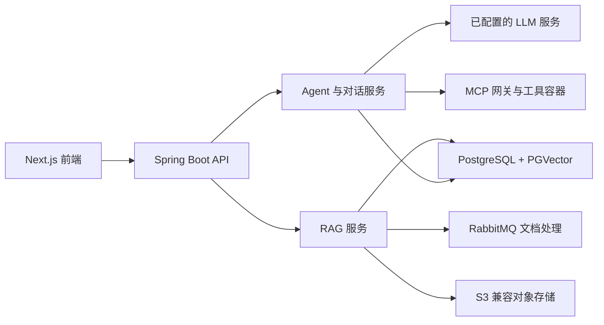

<h1 align="center">RAG Agent Platform</h1>

<p align="center"><strong>把知识库、Agent 与 MCP 工具放进一套可自托管工作流。</strong></p>

<p align="center">
  用 Spring Boot、Next.js 与 LangChain4j 组织检索、对话和工具调用；数据、模型与基础设施始终由你掌控。
</p>

<p align="center"><strong>简体中文</strong> · <a href="README_EN.md">English</a></p>

<p align="center">
  <a href="http://39.97.58.27/explore"><strong>在线演示：39.97.58.27/explore</strong></a>
</p>

<p align="center">
  <a href="https://openjdk.org/"></a>
  <a href="https://spring.io/projects/spring-boot"></a>
  <a href="https://nextjs.org/"></a>
  
</p>

<p align="center">
  <a href="#功能">功能</a> ·
  <a href="#快速开始">快速开始</a> ·
  <a href="#界面预览">界面预览</a> ·
  <a href="#工作原理">工作原理</a> ·
  <a href="#部署说明">部署说明</a> ·
  <a href="#项目范围">项目范围</a> ·
  <a href="#文档">文档</a>
</p>

从文档入库、向量检索到面向用户的 Agent 对话，这个项目把一套 RAG 应用需要的核心路径放在同一控制台：
创建知识库，配置模型与 Agent，再让 Agent 使用已配置的 MCP 工具。它适合希望自主控制数据与部署方式的团队，
并提供部署在阿里云的在线环境，方便直接体验主要流程。


<p align="center"><sub>在一个工作区中管理知识库、Agent、模型提供商与 MCP 工具。</sub></p>

## 功能

| 能力 | 你可以完成什么 |
| --- | --- |
| **知识库与检索** | 上传和处理文档，以 PostgreSQL + PGVector 承载向量检索，并将知识库接入 RAG 问答。 |
| **可配置 Agent** | 配置模型提供商、管理并发布 Agent，并通过 SSE 取得流式对话响应。 |
| **MCP 工具接入** | 让 Agent 接入已配置的 MCP gateway 与工具容器；当前页面不提供完整工具导入流程，运行前需手动配置 gateway 与容器。 |
| **自托管控制** | 使用 Spring Boot、Next.js、RabbitMQ、S3 兼容对象存储和外部模型服务部署自己的工作流。 |

## 快速开始

### 前置条件

- Java 17 与 Maven 3.9+
- Node.js 20 与 pnpm
- PostgreSQL 14+，并安装 `vector` 扩展
- RabbitMQ 3.13+
- S3 兼容对象存储（例如七牛 KODO）
- 已配置的模型 / 重排模型服务与 SMTP 服务
- 使用容器化 MCP 工具时需要 Docker

### 1. 准备服务与配置

创建数据库并启用 PGVector：

```bash
createdb agentx
psql -d agentx -c "CREATE EXTENSION IF NOT EXISTS vector;"
psql -d agentx -f docs/sql/01_init.sql
```

启动 RabbitMQ。以 `.env.example` 为参照创建 `.env`，填写数据库、RabbitMQ、对象存储、模型和 SMTP
相关配置；随后通过 shell 或 IDE 运行配置将这些值提供给后端。Spring Boot 不会自行加载仓库根目录的
`.env` 文件：

```bash
cp .env.example .env
```

在 `frontend/.env.local` 中配置浏览器可见的服务地址：

```dotenv
NEXT_PUBLIC_API_URL=http://localhost:8088/api
NEXT_PUBLIC_WS_URL=ws://localhost:8088/api
```

### 2. 启动应用

在仓库根目录启动后端：

```bash
mvn spring-boot:run
```

另开一个终端启动前端：

```bash
cd frontend
pnpm install
pnpm dev
```

打开 [http://localhost:3000](http://localhost:3000)。后端健康检查地址为
[http://localhost:8088/api/health](http://localhost:8088/api/health)。

## 界面预览

<table>
  <tr>
    <td width="50%" valign="top">
      <strong>知识库列表</strong><br />
      <sub>从同一入口浏览和组织可用于检索的知识库。</sub><br /><br />
      
    </td>
    <td width="50%" valign="top">
      <strong>知识库详情</strong><br />
      <sub>查看文档处理状态与知识库内容。</sub><br /><br />
      
    </td>
  </tr>
  <tr>
    <td width="50%" valign="top">
      <strong>模型提供商配置</strong><br />
      <sub>为 Agent 配置可用的模型服务。</sub><br /><br />
      
    </td>
    <td width="50%" valign="top">
      <strong>已发布 Agent</strong><br />
      <sub>使用其他用户已发布的 Agent 进行对话。</sub><br /><br />
      
    </td>
  </tr>
</table>

## 工作原理


```mermaid
flowchart LR
    Browser["Next.js 前端"] --> API["Spring Boot API"]
    API --> Agent["Agent 与对话服务"]
    API --> RAG["RAG 服务"]
    Agent --> LLM["已配置的 LLM 服务"]
    Agent --> MCP["MCP 网关与工具容器"]
    RAG --> Queue["RabbitMQ 文档处理"]
    RAG --> Data["PostgreSQL + PGVector"]
    RAG --> Storage["S3 兼容对象存储"]
    Agent --> Data
```

浏览器通过 Next.js 控制台访问 Spring Boot API。文档处理任务经 RabbitMQ 异步运行并写入 PGVector；
Agent 结合已配置的模型服务、知识检索与 MCP 工具，当前对话流通过 SSE 返回给前端。

| 区域 | 实现 |
| --- | --- |
| 后端 | Java 17、Spring Boot 3.2.3、LangChain4j |
| 前端 | Next.js 15、React 19 |
| 数据 | PostgreSQL 14+ 与 PGVector |
| 异步任务 | RabbitMQ |
| 文件存储 | S3 兼容对象存储 |
| 流式响应 | Server-Sent Events (SSE) |

## 部署说明

> 仓库内的 Docker Compose 是**作者的部署参考，不是开箱即用的一键安装**：它依赖外部的 PostgreSQL
> 与对象存储，镜像来自私有仓库，MCP 网关也需自行配置。请把它当作起点，按自己的基础设施补齐。

### 运行拓扑

五个容器 + 一个外部数据库。nginx 按路径分流，`/api/` 走后端，其余走前端：

```
                        公网 :80
                           │
                    ┌──────▼──────┐
                    │    nginx    │
                    └──┬───────┬──┘
                 /api/ │       │ /
              ┌────────▼──┐ ┌──▼─────────┐
              │  backend  │ │  frontend  │
              │   :8088   │ │   :3000    │
              │Spring Boot│ │  Next.js   │
              └──┬─────┬──┘ └────────────┘
                 │     │
        ┌────────▼─┐ ┌─▼──────────────┐
        │ RabbitMQ │ │  阿里云 RDS     │  ← 不在 compose 内
        │          │ │ PG + PGVector  │
        └──────────┘ └────────────────┘
                 │
        ┌────────▼──────────┐    ┌──────────────┐
        │ docker.sock       │    │    runner    │
        │ （MCP 工具容器）    │    │ 自托管 CI/CD  │
        └───────────────────┘    └──────────────┘
```

资源配额：backend 1.2 CPU / 1536M，frontend 0.6 / 768M，RabbitMQ 0.3 / 512M。

> ⚠️ backend 的 **1.2 CPU 会影响代码行为**——JVM 据此算出的
> `ForkJoinPool.commonPool` 并行度只有 1。调整前请先读
> [性能优化](docs/operations/performance.md#1-资源边界)。

### 首次部署

```bash
curl -fsSL https://get.docker.com | sh
git clone https://github.com/NEDONION/rag-agent-platform && cd rag-agent-platform
cp .env.example .env && vim .env        # 填数据库、S3、模型服务商等
docker login --username=<用户名> crpi-c6nc3ef4yktaqunc.cn-beijing.personal.cr.aliyuncs.com
sudo docker compose up -d
```

验证：

```bash
curl -i http://localhost:8088/api/health
curl -i http://localhost:3000/api/health
```

### 持续部署

push 到 `main` 自动构建并上线，**无需登录服务器**：

```
push main
   │
   ├─ build   (GitHub 云端)   构建前后端镜像 → 推阿里云 ACR
   ├─ config  (GitHub 云端)   打包 compose 与 nginx 配置为 artifact
   │
   └─ deploy  (服务器 runner) ─┐
                               ├─ 下载 artifact
                               ├─ 记录 IMAGE_TAG 到 .env
                               ├─ docker compose pull backend frontend
                               ├─ docker compose up -d backend frontend
                               ├─ docker compose restart nginx
                               └─ 健康检查（失败则 workflow 变红）
```

部署由服务器上的**自托管 runner 主动向 GitHub 轮询**领取，是纯出站连接。
因此**服务器不需要开放 SSH 或任何入站端口**，GitHub Secrets 里也不存放服务器凭据
（只需 `ACR_USERNAME`、`ACR_PASSWORD`、`DEPLOY_PATH` 三个）。

### 回滚

每次部署把 commit SHA 写进服务器 `.env`，镜像同时打了 `<sha>` 与 `latest` 两个标签：

```bash
sed -i 's|^IMAGE_TAG=.*|IMAGE_TAG=<目标commit-sha>|' .env
docker compose up -d backend frontend
```

完整的环境变量清单、CI/CD 约束、国内网络实测数据与运维检查清单，
见 **[部署指南](docs/operations/deployment.md)**；
部署过程踩过的坑（含错误原文）见 **[排查记录](docs/operations/troubleshooting-log.md)**。


## 项目范围

- 本项目以自托管为主，同时提供部署在阿里云的[在线演示](http://39.97.58.27/explore)供体验。
- 对话流当前使用 SSE。
- Agent 可以接入已配置的 MCP gateway 与工具容器；当前页面不提供完整工具导入流程，运行前需手动配置 gateway 与容器。
- 在生产环境使用前，请先审阅仓库配置与全部基础设施要求。

## 文档

完整文档见 **[文档中心](docs/README.md)**，按架构 / 模块 / 参考 / 运维 / 开发分类。常用入口：

| 文档 | 内容 |
| --- | --- |
| [系统架构](docs/architecture/overview.md) | 技术栈、DDD 分层与数据流 |
| [基础设施](docs/architecture/infrastructure.md) | MQ、存储、传输、加密等技术子包 |
| [RAG 模块](docs/modules/rag.md) | 文档处理、向量检索与 RAG 链路 |
| [Agent 模块](docs/modules/agent.md) | Agent 生命周期与工具集成 |
| [对话模块](docs/modules/conversation.md) | 会话、消息、SSE 与上下文管理 |
| [MCP 工具模块](docs/modules/mcp-tool.md) | 工具上架状态机与容器隔离 |
| [LLM 模块](docs/modules/llm.md) | 服务商、协议适配与高可用 |
| [用户与认证](docs/modules/user-auth.md) | 登录、API Key 与用户设置 |
| [执行追踪](docs/modules/trace.md) | 可观测性与执行链路记录 |
| [任务与调度](docs/modules/task.md) | 工作流任务与定时任务 |
| [API 参考](docs/reference/api.md) | REST 与 SSE 接口 |
| [数据库设计](docs/reference/database.md) | 表结构、ER 图与索引 |
| [部署指南](docs/operations/deployment.md) | 拓扑、CI/CD 与回滚 |
| [本地开发](docs/development/local-setup.md) | 环境搭建与提交流程 |
| [排查记录](docs/operations/troubleshooting-log.md) | 线上问题实录，持续更新 |
| [数据库初始化](docs/sql/01_init.sql) | PostgreSQL 与 PGVector 完整建表脚本（35 张表） |

## 参与贡献

欢迎提交 Issue 和 Pull Request。请描述问题、运行环境及已完成的验证。
