# RAG Agent Platform

<div align="center">

**基于 LLM、RAG 与 MCP 的多租户智能体 SaaS 平台**

[](https://openjdk.java.net/)
[](https://spring.io/projects/spring-boot)
[](https://nextjs.org/)
[](https://www.postgresql.org/)
[](LICENSE)

[English](./README_EN.md) | 简体中文

</div>

---

## 📖 项目简介

**RAG Agent Platform** 是一个企业级多租户智能体 SaaS 平台，整合了大语言模型（LLM）、检索增强生成（RAG）和模型上下文协议（MCP）技术。平台为用户提供：

- 🧠 **智能知识库** - 上传文档（PDF/WORD/TXT），自动 OCR 识别 + 向量化，构建企业级知识库
- 🤖 **Agent 编排** - 基于 LangChain4j 快速创建智能体，支持工具调用、多轮对话、任务分解
- 🔌 **一键集成** - 灵活接入 OpenAI、SiliconFlow 等多种 LLM 服务商，支持主备模型切换
- 🛠️ **工具生态** - 容器化 MCP 工具管理，支持 Docker/GitHub/NPM 多种部署方式
- 📊 **精确计费** - Token 级别成本统计，完整执行链路追踪
- 🔒 **多租户隔离** - 数据库级别隔离，JWT 认证，保障数据安全

---

## ✨ 核心特性

### 🎯 RAG 增强能力

- **Vision LLM OCR** - 智能识别数学公式、表格、代码块
- **混合检索** - 向量召回 + Rerank 精排 + 查询扩展
- **版本化机制** - 支持引用型（实时同步）和快照型（数据隔离）两种版本模式
- **进度追踪** - 实时展示 OCR 和向量化处理进度（0-100%）
- **降级召回** - 相似度阈值过高时自动降低重试，保证召回率

### 🤖 Agent 智能编排

- **LangChain4j 集成** - 标准化 Agent 编排框架，支持流式输出
- **MCP 工具集成** - 容器化工具管理，支持 Function Calling
- **多模态支持** - 文本 + 图像输入，支持 Vision 模型
- **版本管理** - Agent 草稿编辑 → 审核 → 发布 → 回滚完整流程
- **执行追踪** - 双表追踪模型（汇总 + 详情），记录每次执行的完整链路

### 💰 计费与成本管理

- **Token 级别计费** - 精确到小数点后 8 位
- **使用记录** - 记录每次 Agent 执行的成本（输入/输出 Token、模型费用）
- **账户余额** - 支持充值、扣减、退款
- **订单管理** - 支持支付宝、Stripe 等支付方式

### 🔒 安全与多租户

- **JWT 认证** - 无状态认证（7 天有效期）
- **数据隔离** - 数据库层面多租户隔离（MyBatis-Plus 插件）
- **API Key 加密** - AES 加密存储用户密钥
- **限流** - Guava RateLimiter 保护 API
- **逻辑删除** - 软删除保留历史数据

---

## 🏗️ 系统架构

### 整体架构

```mermaid
graph TB
    subgraph "前端层 Frontend"
        A[Next.js 15 App Router]
        B[React 19 Components]
        C[Tailwind CSS]
    end

    subgraph "网关层 Gateway"
        D[Nginx / Cloudflare]
    end

    subgraph "应用层 Application Layer"
        E[Spring Boot 3.2.3]
        F[REST API]
        G[WebSocket]
    end

    subgraph "领域层 Domain Layer"
        H[Agent 领域]
        I[RAG 领域]
        J[LLM 领域]
        K[工具领域]
        L[用户领域]
    end

    subgraph "基础设施层 Infrastructure"
        M[(PostgreSQL 14<br/>+ PGVector)]
        N[RabbitMQ]
        O[Docker Engine]
        P[七牛云 KODO<br/>对象存储]
    end

    subgraph "外部服务 External Services"
        Q[LLM 服务商<br/>SiliconFlow / OpenAI]
        R[Embedding 模型]
        S[Rerank 模型]
    end

    A --> D
    D --> F
    D --> G
    F --> E
    G --> E
    E --> H
    E --> I
    E --> J
    E --> K
    E --> L
    H --> M
    I --> M
    J --> M
    K --> M
    L --> M
    H --> N
    I --> N
    K --> O
    I --> P
    H --> Q
    I --> R
    I --> S

    style A fill:#61dafb
    style E fill:#6db33f
    style M fill:#336791
    style N fill:#ff6600
    style Q fill:#10a37f
```



### DDD 分层架构

```mermaid
graph TB
    subgraph "接口层 Interfaces Layer"
        A1[REST Controller]
        A2[WebSocket Handler]
        A3[DTO Mapping]
    end

    subgraph "应用层 Application Layer"
        B1[AgentAppService]
        B2[RagAppService]
        B3[LlmAppService]
        B4[ToolAppService]
        B5[事务边界管理]
    end

    subgraph "领域层 Domain Layer"
        C1[DomainService<br/>核心业务逻辑]
        C2[Entity<br/>领域实体]
        C3[Repository Interface<br/>仓储接口]
        C4[MessageConsumer<br/>消息消费者]
    end

    subgraph "基础设施层 Infrastructure"
        D1[Repository Impl<br/>MyBatis-Plus]
        D2[LLM Factory]
        D3[Docker Client]
        D4[OSS Client]
    end

    A1 --> B1
    A2 --> B2
    B1 --> C1
    B2 --> C1
    C1 --> C2
    C1 --> C3
    C3 -.依赖倒置.-> D1
    C4 --> C1
    D1 --> D2
    D1 --> D3
    D1 --> D4

    style A1 fill:#e3f2fd
    style B1 fill:#fff3e0
    style C1 fill:#f3e5f5
    style D1 fill:#e8f5e9
```



### RAG 处理流程

```mermaid
sequenceDiagram
    participant U as 用户
    participant API as Backend API
    participant MQ as RabbitMQ
    participant OCR as OCR Consumer
    participant VEC as Vector Consumer
    participant LLM as Vision LLM
    participant DB as PostgreSQL
    participant PGV as PGVector
    participant OSS as 对象存储

    U->>API: 上传文档
    API->>OSS: 存储文件
    API->>DB: 创建 file_detail 记录
    API->>MQ: 发送 OCR 消息

    MQ->>OCR: 消费 OCR 消息
    OCR->>OSS: 下载文件
    OCR->>LLM: Vision LLM 识别<br/>(公式/表格/代码)
    LLM-->>OCR: 返回 OCR 结果
    OCR->>DB: 存储 document_unit
    OCR->>MQ: 发送向量化消息

    MQ->>VEC: 消费向量化消息
    VEC->>DB: 读取 document_unit
    VEC->>LLM: Embedding 模型
    LLM-->>VEC: 返回向量
    VEC->>PGV: 存储向量
    VEC->>DB: 更新处理状态

    U->>API: 查询知识库
    API->>PGV: 向量检索
    PGV-->>API: 返回相似片段
    API->>LLM: Rerank 精排
    LLM-->>API: 返回最佳结果
    API-->>U: 返回答案
```



### Agent 执行流程

```mermaid
sequenceDiagram
    participant U as 用户
    participant API as Backend API
    participant AG as Agent Service
    participant LLM as LLM Model
    participant MCP as MCP Server
    participant RAG as RAG Service
    participant DB as PostgreSQL

    U->>API: 发送消息
    API->>AG: 创建会话
    AG->>DB: 加载 Agent 配置

    loop 多轮对话
        AG->>RAG: 检索相关知识
        RAG-->>AG: 返回上下文
        AG->>LLM: 发送 Prompt + 上下文 + 工具定义

        alt LLM 决定调用工具
            LLM-->>AG: 返回 Tool Call
            AG->>MCP: 调用工具
            MCP-->>AG: 工具执行结果
            AG->>LLM: 注入工具结果
        end

        LLM-->>AG: 返回 AI 响应
    end

    AG->>DB: 保存执行记录<br/>(summary + details)
    AG->>DB: 扣减用户余额
    AG-->>U: 流式返回结果
```



### 技术栈架构

```mermaid
graph TB
    subgraph "前端技术栈"
        FE1[Next.js 15 + React 19]
        FE2[TypeScript 5]
        FE3[Tailwind CSS]
        FE4[Radix UI]
        FE5[React Hook Form + Zod]
    end

    subgraph "后端技术栈"
        BE1[Spring Boot 3.2.3]
        BE2[LangChain4j 1.0.4.3]
        BE3[MyBatis-Plus 3.5.11]
        BE4[RabbitMQ 5.21.0]
        BE5[Docker Java 3.3.6]
    end

    subgraph "数据存储"
        DS1[(PostgreSQL 14)]
        DS2[(PGVector 向量库)]
        DS3[七牛云 KODO]
    end

    subgraph "AI 服务"
        AI1[SiliconFlow API]
        AI2[GPT-4 / Qwen2.5]
        AI3[text-embedding-3-large]
        AI4[bge-reranker-v2-m3]
    end

    FE1 --> BE1
    BE2 --> BE1
    BE3 --> DS1
    BE4 --> DS1
    BE5 --> DS1
    BE1 --> DS2
    BE1 --> DS3
    BE1 --> AI1
    AI1 --> AI2
    AI1 --> AI3
    AI1 --> AI4
```



---

## 🛠️ 技术栈

### 后端

| 技术 | 版本 | 说明 |
|------|------|------|
| Java | 17 | 编程语言 |
| Spring Boot | 3.2.3 | 应用框架 |
| LangChain4j | 1.0.4.3-beta7 | Agent 编排框架 |
| MyBatis-Plus | 3.5.11 | ORM 框架 |
| PostgreSQL | 14+ | 关系数据库 |
| PGVector | 0.5.0 | 向量数据库扩展 |
| RabbitMQ | 5.21.0 | 消息队列 |
| Docker Java | 3.3.6 | 容器管理 |
| JWT | 0.12.5 | 认证 |
| Apache PDFBox | 3.0.2 | PDF 处理 |
| Apache POI | 5.4.0 | Office 文档处理 |

### 前端

| 技术 | 版本 | 说明 |
|------|------|------|
| Next.js | 15.1.0 | React 框架 |
| React | 19 | UI 库 |
| TypeScript | 5 | 类型安全 |
| Tailwind CSS | 3.4.17 | 原子化 CSS |
| Radix UI | - | 无头 UI 组件 |
| React Hook Form | 7.54.1 | 表单管理 |
| Zod | 3.24.1 | Schema 验证 |
| Axios | 1.8.4 | HTTP 客户端 |
| Xterm.js | - | 终端模拟器 |

### 基础设施

- **对象存储**: 七牛云 KODO / Amazon S3
- **LLM 服务商**: SiliconFlow（硅基流动）
- **部署**: Docker Compose
- **监控**: Spring Boot Actuator

---

## 📦 功能模块

### 1️⃣ Agent 智能体模块

- ✅ Agent 创建、编辑、删除
- ✅ System Prompt 配置（定义角色与行为）
- ✅ 工具集成（MCP 工具调用）
- ✅ 知识库关联（RAG 增强）
- ✅ 多模态支持（文本 + 图像）
- ✅ 版本发布、审核、回滚
- ✅ 会话管理（多轮对话）
- ✅ 执行追踪（完整链路记录）
- ✅ 成本统计（Token 级别计费）

### 2️⃣ RAG 知识库模块

- ✅ 文档上传（PDF/WORD/TXT/MD）
- ✅ Vision LLM OCR（识别公式/表格/代码）
- ✅ 向量化处理（Embedding 模型）
- ✅ 混合检索（向量召回 + Rerank 精排）
- ✅ 查询扩展（获取相邻页面上下文）
- ✅ 版本化机制（引用型 vs 快照型）
- ✅ 进度追踪（实时展示处理进度）
- ✅ 降级召回（阈值自动调整）

### 3️⃣ LLM 模型管理

- ✅ 模型提供商管理（OpenAI、SiliconFlow 等）
- ✅ 模型配置（API Key、Base URL、模型 ID）
- ✅ Embedding 模型管理
- ✅ 模型高可用（主模型 + 平替模型）
- ✅ Token 计费（精确到小数点后 8 位）

### 4️⃣ MCP 工具模块

- ✅ 工具定义（Function Schema）
- ✅ 工具上传（Docker/GitHub/NPM）
- ✅ 容器化部署（Docker Engine）
- ✅ 工具调用（Function Calling）
- ✅ 工具预设参数（加密存储）

### 5️⃣ 用户与认证

- ✅ 用户注册/登录（JWT 认证）
- ✅ 邮箱验证码（SMTP）
- ✅ 图形验证码（防机器人）
- ✅ 密码重置
- ✅ 用户设置（模型配置、Fallback 策略）

### 6️⃣ 计费与账户

- ✅ 账户余额管理
- ✅ Token 级别计费（输入 Token + 输出 Token）
- ✅ 使用记录（每次 Agent 执行）
- ✅ 交易记录（充值、扣减、退款）
- ✅ 订单管理（充值订单、支付回调）

---

## 🚀 快速开始

### 前置要求

- Java 17+
- Node.js 18+
- PostgreSQL 14+（需安装 PGVector 扩展）
- RabbitMQ 3.13+
- Docker & Docker Compose
- 对象存储服务（七牛云 KODO / Amazon S3）
- LLM API Key（SiliconFlow / OpenAI）

### 本地开发

#### 1. 安装 PostgreSQL + PGVector

```bash
# macOS
brew install postgresql@14
brew services start postgresql@14

# 创建数据库和扩展
psql -d postgres -c "CREATE DATABASE agentx;"
psql -d agentx -c "CREATE EXTENSION IF NOT EXISTS vector;"
```

#### 2. 安装 RabbitMQ

```bash
# macOS
brew install rabbitmq
brew services start rabbitmq

# 访问管理界面: http://localhost:15672
# 默认账号: guest / guest
```

#### 3. 配置环境变量

复制 `.env.example` 为 `.env` 并填写配置：

```bash
# 数据库配置
DB_HOST=localhost
DB_PORT=5432
DB_USER=postgres
DB_PASSWORD=postgres
DB_NAME=agentx

# RabbitMQ
RABBITMQ_HOST=localhost
RABBITMQ_PASSWORD=guest

# 对象存储（七牛云）
S3_SECRET_ID=your-access-key
S3_SECRET_KEY=your-secret-key
S3_BUCKET_NAME=your-bucket
S3_DOMAIN=https://your-domain/

# AI 模型（硅基流动）
SILICONFLOW_API_KEY=sk-xxx

# 前端配置
NEXT_PUBLIC_API_URL=http://localhost:8088/api
NEXT_PUBLIC_WS_URL=ws://localhost:8088/api
```

#### 4. 初始化数据库

```bash
psql -h localhost -U postgres -d agentx -f ./docs/sql/01_init.sql
```

#### 5. 启动后端

```bash
# Maven 构建
mvn clean install -DskipTests

# 启动 Spring Boot
mvn spring-boot:run
```

访问: http://localhost:8088/api/health

#### 6. 启动前端

```bash
cd frontend
npm install
npm run dev
```

访问: http://localhost:3000

#### 7. 默认账号

- 管理员: `admin@agentx.ai / admin123`
- 测试账号: `test@agentx.ai / test123`

---

## 🐳 Docker Compose 部署

### 一键部署

```bash
# 1. 克隆项目
git clone https://github.com/NEDONION/rag-agent-platform
cd rag-agent-platform

# 2. 配置环境变量
cp .env.example .env
vim .env

# 3. 启动服务
docker compose up -d

# 4. 查看日志
docker logs -f agentx-backend
docker logs -f agentx-frontend

# 5. 访问应用
# 前端: http://your-server-ip:3000
# 后端: http://your-server-ip:8088/api
```

### 服务说明

| 服务 | 端口 | 说明 |
|------|------|------|
| frontend | 3000 | Next.js 前端 |
| backend | 8088 | Spring Boot 后端 |
| rabbitmq | 5672, 15672 | RabbitMQ 消息队列 |

### 资源限制

- **Backend**: 768M-1536M 内存, 0.8-1.2 核 CPU
- **Frontend**: 384M-768M 内存, 0.3-0.6 核 CPU
- **RabbitMQ**: 256M-512M 内存, 0.1-0.3 核 CPU

详细部署指南请查看: [DEPLOY.md](./DEPLOY.md)

---

## 📚 项目结构

```
rag-agent-platform/
├── frontend/                # Next.js 15 前端应用
│   ├── app/                # App Router 页面
│   │   ├── (auth)/         # 认证相关页面
│   │   ├── (main)/         # 主应用页面
│   │   │   ├── studio/     # Agent 工作室
│   │   │   ├── workspace/  # 工作区
│   │   │   ├── knowledge/  # 知识库管理
│   │   │   ├── settings/   # 设置中心
│   │   │   ├── explore/    # 探索市场
│   │   │   └── admin/      # 管理后台
│   │   └── providers.tsx   # 全局 Provider
│   ├── components/         # 可复用组件
│   ├── hooks/              # 自定义 Hooks
│   └── types/              # TypeScript 类型
│
├── src/main/               # Spring Boot 后端应用
│   ├── java/org/lucas/
│   │   ├── application/    # 应用层（AppService）
│   │   ├── domain/         # 领域层（DomainService + Entity）
│   │   ├── infrastructure/ # 基础设施层（Repository + Utils）
│   │   └── interfaces/     # 接口层（Controller + DTO）
│   └── resources/
│       └── application.yml # 配置文件
│
├── docs/                   # 技术文档
│   ├── ARCHITECTURE.md     # 系统架构文档
│   ├── DATABASE.md         # 数据库设计文档
│   ├── API.md              # API 接口文档
│   ├── RAG_MODULE.md       # RAG 模块文档
│   └── AGENT_MODULE.md     # Agent 模块文档
│
├── docker-compose.yml      # Docker Compose 配置
├── Dockerfile              # 后端 Dockerfile
├── .env.example            # 环境变量示例
├── DEPLOY.md               # 部署指南
└── README.md               # 项目说明
```

---

## 📖 API 文档

详细 API 文档请查看: [docs/API.md](./docs/API.md)

### 核心 API 端点

#### 认证 API

- `POST /login` - 用户登录
- `POST /register` - 用户注册
- `POST /get-captcha` - 获取图形验证码
- `POST /send-email-code` - 发送邮箱验证码

#### Agent API

- `GET /api/agents` - 获取 Agent 列表
- `POST /api/agents` - 创建 Agent
- `PUT /api/agents/{id}` - 更新 Agent
- `POST /api/agents/{id}/publish` - 发布版本
- `GET /api/agents/{id}/versions` - 版本历史

#### 会话 API

- `GET /api/sessions` - 获取会话列表
- `POST /api/sessions` - 创建会话
- `POST /api/sessions/{id}/messages` - 发送消息（SSE 流式）
- `GET /api/sessions/{id}/messages` - 获取消息历史

#### RAG API

- `GET /api/rags` - 获取知识库列表
- `POST /api/rags` - 创建知识库
- `POST /api/rags/{id}/files/upload` - 上传文件
- `GET /api/rags/{id}/files/{fileId}/status` - 文件处理状态
- `POST /rag/search` - RAG 检索

---

## 📸 产品截图

### Agent 工作室


### 知识库管理


### 对话界面


---

## 🎯 适用场景

- **企业知识库问答** - 上传内部文档，构建企业级 RAG 系统
- **客服智能助手** - 集成 CRM 工具，提供 7×24 智能客服
- **代码助手** - 集成 GitHub 工具，辅助代码审查与生成
- **数据分析 Agent** - 集成数据库查询工具，自然语言查询数据
- **多模态应用** - 图像识别 + 文本理解
- **SaaS 平台** - 多租户隔离，支持订阅计费

---

## 🔧 开发指南

### 代码规范

- **后端**: 遵循 DDD 分层架构，使用 Spotless 格式化代码
- **前端**: 遵循 Next.js 最佳实践，使用 ESLint + Prettier

### 数据库迁移

```bash
# 创建新的迁移脚本
psql -d agentx -f ./docs/sql/migrations/V2_xxx.sql
```

### 测试

```bash
# 后端单元测试
mvn test

# 前端测试
cd frontend
npm test
```

### 本地调试

#### 后端

1. IDEA 打开项目
2. 运行 `RAGAgentPlatformApplication.java`
3. 访问 http://localhost:8088/api/health

#### 前端

1. VSCode 打开 `frontend` 目录
2. 运行 `npm run dev`
3. 访问 http://localhost:3000

---

## 💡 技术亮点

### 1. DDD 分层架构
- 业务逻辑集中在领域层
- 清晰的领域模型
- 依赖倒置原则

### 2. RAG 技术
- Vision LLM OCR 识别公式/表格
- 混合检索（向量召回 + Rerank 精排）
- 查询扩展保证上下文完整性
- 降级召回提升召回率

### 3. Agent 编排
- LangChain4j 标准化框架
- MCP 工具容器化管理
- 执行链路完整追踪
- 多模态支持

### 4. 性能优化
- 19 个并发 RabbitMQ 消费者
- PGVector IVFFlat 索引
- HikariCP 连接池（最大 20 连接）
- 模型实例缓存

### 5. 安全设计
- JWT 无状态认证
- 多租户数据隔离
- API Key AES 加密
- Guava 限流

---

## 🤝 贡献指南

欢迎贡献代码！请遵循以下流程：

1. Fork 本仓库
2. 创建特性分支 (`git checkout -b feature/AmazingFeature`)
3. 提交更改 (`git commit -m 'Add some AmazingFeature'`)
4. 推送到分支 (`git push origin feature/AmazingFeature`)
5. 提交 Pull Request

---

## 📄 许可证

本项目采用 [MIT License](LICENSE) 开源许可证。

---

## 🙏 致谢

- [LangChain4j](https://github.com/langchain4j/langchain4j) - 强大的 Java LLM 框架
- [Spring Boot](https://spring.io/projects/spring-boot) - 企业级 Java 框架
- [Next.js](https://nextjs.org/) - 优秀的 React 框架
- [PGVector](https://github.com/pgvector/pgvector) - PostgreSQL 向量数据库扩展
- [SiliconFlow](https://www.siliconflow.com/) - 国内领先的 AI 模型平台

---

## 📞 联系方式

- **项目主页**: https://github.com/NEDONION/rag-agent-platform
- **问题反馈**: https://github.com/NEDONION/rag-agent-platform/issues
- **邮箱**: nedonion@outlook.com

---

<div align="center">

**如果这个项目对你有帮助，请给我们一个 ⭐️ Star！**

Made with ❤️ by [NEDONION](https://github.com/NEDONION)

</div>
